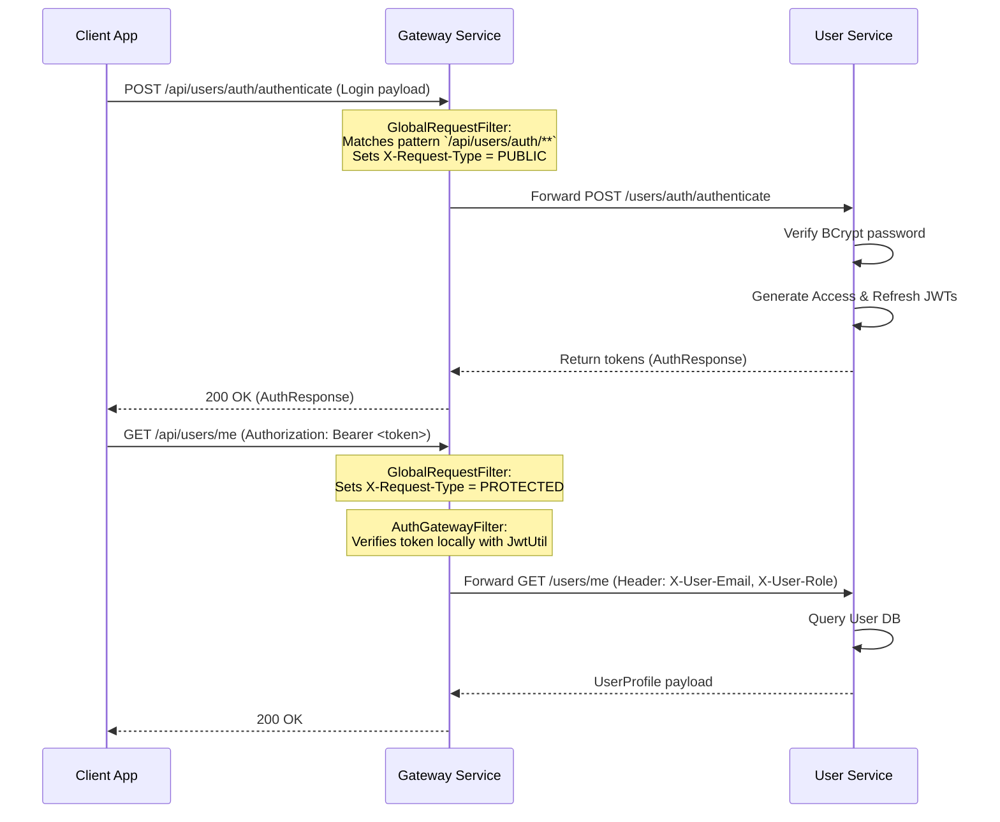
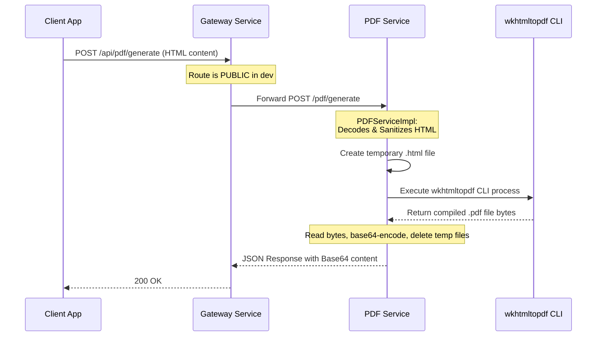

I will start by listing the contents of the project directory to understand the structure of the repository.

Listed directory resume-builder-backend

I will read the `README.md` file to understand the project's purpose, architecture, and overview.

Viewed README.md:1-490

I will read the `ROADMAP.md` to see the planned steps and any additional details about the features.

Viewed ROADMAP.md:1-290

I will view the parent `pom.xml` to see how the maven modules and dependencies are managed.

Viewed pom.xml:1-220

I will list files inside the `common` module to understand what shared components are available.

Listed directory common

I will run a command to list all Java files in the workspace. This will show the entire codebase structure.

Ran command: `find . -name "*.java"`

I will view the files in the `common` module to understand the shared models, utilities, exceptions, and constants. Let's look at `BaseRequest.java` and `BaseResponse.java` first.

Viewed BaseRequest.java:1-15

I will view `BaseResponse.java` from the `common` module.

Viewed BaseResponse.java:1-16

I will view the `ResponseProcessingStatus.java` and `UserRole.java` files.

Viewed ResponseProcessingStatus.java:1-9

I will view `UserRole.java` from the `common` module.

Viewed UserRole.java:1-8

I will view `JwtTokenType.java`, `ErrorResponse.java`, and `SuccessResponse.java` files.

Viewed JwtTokenType.java:1-20

I will view `ErrorResponse.java`.

Viewed ErrorResponse.java:1-13

I will view `SuccessResponse.java`.

Viewed SuccessResponse.java:1-14

I will view the files in `com/tu2l/common/constant/`. Let's view `CommonConstants.java`.

Viewed CommonConstants.java:1-233

I will view the contents of `ServiceIdentifiers.java` and `RequestType.java`.

Viewed ServiceIdentifiers.java:1-19

I will view `RequestType.java`.

Viewed RequestType.java:1-41

I will view the `CommonUtil.java` and `JwtUtil.java` utility files. Let's look at `CommonUtil.java` first.

Viewed CommonUtil.java:1-79

I will view `JwtUtil.java`.

Viewed JwtUtil.java:1-241

I will view the `AuthenticationException.java` and `ResponseFactory.java` files. Let's look at `AuthenticationException.java` first.

Viewed AuthenticationException.java:1-12

I will view `ResponseFactory.java`.

Viewed ResponseFactory.java:1-70

I will view `PDFServiceApplication.java` and `BeansConfiguration.java` from the `pdf-service` module to see the entry point and bean configuration. Let's look at `PDFServiceApplication.java` first.

Viewed PDFServiceApplication.java:1-20

I will view `BeansConfiguration.java`.

Viewed BeansConfiguration.java:1-15

I will view the interfaces and classes inside `com/tu2l/pdf/generator/` to understand how HTML-to-PDF conversion is designed and executed. Let's start with `PDFGenerator.java`.

Viewed PDFGenerator.java:1-11

I will view `PDFGeneratorConfiguration.java`.

Viewed PDFGeneratorConfiguration.java:1-75

I will view `WkhtmlToPdfGenerator.java`.

Viewed WkhtmlToPdfGenerator.java:1-106

I will view the JPA entity, the Spring Data repository, and the entity mapper utility in `pdf-service`. Let's look at `GeneratedPDFEntity.java` first.

Viewed GeneratedPDFEntity.java:1-34

I will view `PDFRepository.java`.

Viewed PDFRepository.java:1-11

I will view `EntityMapper.java`.

Viewed EntityMapper.java:1-51

I will view the request and response models in `com/tu2l/pdf/model/` next. Let's start with `GeneratePDFRequest.java`.

Viewed GeneratePDFRequest.java:1-22

I will view `GenerateAndSavePDFRequest.java`.

Viewed GenerateAndSavePDFRequest.java:1-13

I will view `GeneratePDFResponse.java`.

Viewed GeneratePDFResponse.java:1-14

I will view `PDFException.java` and `GlobalExceptionHandler.java`. Let's look at `PDFException.java` first.

Viewed PDFException.java:1-13

I will view `GlobalExceptionHandler.java` in `pdf-service`.

Viewed GlobalExceptionHandler.java:1-66

I will view the `PDFService.java`, `PDFServiceImpl.java`, and `AsyncPDFService.java` files. Let's start with `PDFService.java`.

Viewed PDFService.java:1-19

I will view `PDFServiceImpl.java`.

Viewed PDFServiceImpl.java:1-122

I will view `AsyncPDFService.java`.

Viewed AsyncPDFService.java:1-60

I will view the REST controller class `PDFController.java` to see the REST endpoints exposed by `pdf-service`.

Viewed PDFController.java:1-65

I will view `GatewayServiceApplication.java` and `CustomGatewayProperties.java` from the `gateway-service` module. Let's look at `GatewayServiceApplication.java` first.

Viewed GatewayServiceApplication.java:1-21

I will view `CustomGatewayProperties.java`.

Viewed CustomGatewayProperties.java:1-17

I will view the `BeansConfiguration.java` and `GatewayConfig.java` files. Let's look at `BeansConfiguration.java` first.

Viewed BeansConfiguration.java:1-42

I will view `GatewayConfig.java`.

Viewed GatewayConfig.java:1-44

I will view the authentication filtering classes in the gateway. Let's start with `AuthGatewayFilter.java`.

Viewed AuthGatewayFilter.java:1-107

I will view `AuthGatewayService.java`.

Viewed AuthGatewayService.java:1-38

I will view `AuthGatewayServiceImpl.java`.

Viewed AuthGatewayServiceImpl.java:1-52

I will view `GlobalRequestFilter.java` and `WebPathUtil.java`. Let's look at `GlobalRequestFilter.java` first.

Viewed GlobalRequestFilter.java:1-66

I will view `WebPathUtil.java`.

Viewed WebPathUtil.java:1-23

I will run a command to list all configuration files (`.properties`, `.yml`, `.yaml`, `.env`) in the workspace to see where the configurations for each service are stored.

Ran command: `find . -name "*.properties" -o -name "*.yml" -o -name "*.yaml" -o -name ".env"`

I will view the `application.yml` for the `gateway-service` to understand the routes and service mapping configurations.

Viewed application.yml:1-6

I will view the `application-dev.yml` for the gateway service to see the dev route configurations.

Viewed application-dev.yml:1-43

I will view the `.env` file in the root directory to check what environment variables are used.

Viewed .env:1-10

I will view the JPA entities in `user-service` to understand the data schema. Let's look at `UserEntity.java` first.

Viewed UserEntity.java:1-146

I will view `UserProfile.java` and `UserCredential.java`. Let's look at `UserProfile.java` first.

Viewed UserProfile.java:1-67

I will view `UserCredential.java`.

Viewed UserCredential.java:1-68

I will view `UserAccountStatus.java`.

Viewed UserAccountStatus.java:1-73

I will view `AuthenticationController.java` to see the REST API endpoints related to authentication (register, login, reset-password, etc.).

Viewed AuthenticationController.java:1-127

I will view the `AuthenticationService.java` and `AuthenticationServiceImpl.java` files. Let's look at `AuthenticationService.java` first.

Viewed AuthenticationService.java:1-105

I will view `AuthenticationServiceImpl.java`.

Viewed AuthenticationServiceImpl.java:1-157

I will view `UserServiceImpl.java` and `PasswordServiceImpl.java`. Let's look at `UserServiceImpl.java` first.

Viewed UserServiceImpl.java:1-138

I will view `PasswordServiceImpl.java`.

Viewed PasswordServiceImpl.java:1-25

I will view `JwtServiceImpl.java`.

Viewed JwtServiceImpl.java:1-75

I will view `EmailServiceImpl.java`.

Viewed EmailServiceImpl.java:1-18

I will view `UserController.java` to see the REST endpoints for user profile management.

Viewed UserController.java:1-203

I will view `AuthorizationController.java` to see the REST endpoints for user authorization checking and roles/permissions management.

Viewed AuthorizationController.java:1-147

I will view `application.yml` and `application-dev.yml` under `user-service/src/main/resources/`. Let's look at `application-dev.yml` first.

Viewed application-dev.yml:1-49

I will view the main `application.yml` for `user-service`.

Viewed application.yml:1-4

I will view `application.yml` and `application-dev.yml` under `pdf-service/src/main/resources/`. Let's look at `application-dev.yml` first.

Viewed application-dev.yml:1-34

I will view `application.yml` under `pdf-service/src/main/resources/`.

Viewed application.yml:1-4

I will list the contents of the `etc` directory to see if there are any database files, shell scripts, or other configurations.

Listed directory etc

I will check the `etc/requests` directory.

Listed directory requests

I will view the `user-service.http` file to see how HTTP requests are structured for testing the `user-service` API.

Viewed user-service.http:1-34

# Project Analysis Report: Resume Builder Backend

The **Resume Builder Backend** is a modern, microservices-based system built using **Java 17**, **Spring Boot 4.0.0**, and **Maven**. It handles user registration, authentication, authorization, and PDF generation from HTML templates (resumes).

The codebase is organized as a multi-module Maven project where dependencies are managed centrally in the parent [pom.xml](file:///home/tu2l/Repositories/backend/resume-builder-backend/pom.xml). 

---

## 🏗️ Architecture & Module Structure

The project contains four key Maven modules:
1. **[common](file:///home/tu2l/Repositories/backend/resume-builder-backend/common)**: Shared utilities, base DTOs, security constants, and JWT token processing.
2. **[gateway-service](file:///home/tu2l/Repositories/backend/resume-builder-backend/gateway-service)**: The Spring Cloud Gateway (running on port `8080` in dev), serving as the unified entry point. It handles path routing, CORS, and request authentication.
3. **[pdf-service](file:///home/tu2l/Repositories/backend/resume-builder-backend/pdf-service)**: A specialized service (running on port `8090` in dev) that compiles HTML into high-quality PDFs via the CLI-based tool `wkhtmltopdf`. It supports database persistence and both synchronous and asynchronous PDF generation.
4. **[user-service](file:///home/tu2l/Repositories/backend/resume-builder-backend/user-service)**: A service (running on port `8091` in dev) that manages user accounts, user profiles, credentials (tokens), and user sessions.

Both services are backed by a PostgreSQL database in the development profile (`dev`) on port `5432` with a database named `postgres`.

---

## 🔍 Module & File-by-File Breakdown

### 1. Common Module (`common`)
This module contains standard components shared by downstream microservices.

*   **Models & Enums**:
    *   [BaseRequest.java](file:///home/tu2l/Repositories/backend/resume-builder-backend/common/src/main/java/com/tu2l/common/model/base/BaseRequest.java): A marker interface for API request DTOs.
    *   [BaseResponse.java](file:///home/tu2l/Repositories/backend/resume-builder-backend/common/src/main/java/com/tu2l/common/model/base/BaseResponse.java): Abstract base class for API responses containing `id`, `message`, and `status`.
    *   [ResponseProcessingStatus.java](file:///home/tu2l/Repositories/backend/resume-builder-backend/common/src/main/java/com/tu2l/common/model/states/ResponseProcessingStatus.java): Enum for request execution states (`SUCCESS`, `FAILURE`, `PROCESSING`, `UNDEFINED`).
    *   [UserRole.java](file:///home/tu2l/Repositories/backend/resume-builder-backend/common/src/main/java/com/tu2l/common/model/states/UserRole.java): Roles defined in the system (`USER`, `ADMIN`, `MODERATOR`, `GUEST`).
    *   [JwtTokenType.java](file:///home/tu2l/Repositories/backend/resume-builder-backend/common/src/main/java/com/tu2l/common/model/JwtTokenType.java): Enum identifying tokens (`ACCESS`, `REFRESH`, `PASSWORD_RESET`, `EMAIL_VERIFICATION`).
    *   [SuccessResponse.java](file:///home/tu2l/Repositories/backend/resume-builder-backend/common/src/main/java/com/tu2l/common/model/SuccessResponse.java) & [ErrorResponse.java](file:///home/tu2l/Repositories/backend/resume-builder-backend/common/src/main/java/com/tu2l/common/model/ErrorResponse.java): Standard extensions of `BaseResponse` using Lombok's `@Builder`.
    *   [ResponseFactory.java](file:///home/tu2l/Repositories/backend/resume-builder-backend/common/src/main/java/com/tu2l/common/factory/ResponseFactory.java): Static factory to build `SuccessResponse` and `ErrorResponse` objects uniformly.

*   **Constants**:
    *   [CommonConstants.java](file:///home/tu2l/Repositories/backend/resume-builder-backend/common/src/main/java/com/tu2l/common/constant/CommonConstants.java): A massive utility holding static classes for HTTP headers, JWT Claims, Regex validation patterns (email, password, UUID, etc.), and default config options (e.g. page sizing margins).
    *   [ServiceIdentifiers.java](file:///home/tu2l/Repositories/backend/resume-builder-backend/common/src/main/java/com/tu2l/common/constant/ServiceIdentifiers.java): Enum containing service contexts and base paths (e.g., `/users`, `/pdf`).
    *   [RequestType.java](file:///home/tu2l/Repositories/backend/resume-builder-backend/common/src/main/java/com/tu2l/common/constant/RequestType.java): Enum parsing `PUBLIC` vs `PROTECTED` requests.

*   **Utilities & Exceptions**:
    *   [CommonUtil.java](file:///home/tu2l/Repositories/backend/resume-builder-backend/common/src/main/java/com/tu2l/common/util/CommonUtil.java): Provides HTML sanitization to prevent XSS (removes scripts, `javascript:`, `file://`, `data:` URLs, `iframe`, `object`, and `embed` tags), Base64 encoding/decoding, and email regex checking.
    *   [JwtUtil.java](file:///home/tu2l/Repositories/backend/resume-builder-backend/common/src/main/java/com/tu2l/common/util/JwtUtil.java): Low-level JJWT wrapper to generate and parse keys, validate lifetimes, and read specific claims like user ID, roles, and types.
    *   [AuthenticationException.java](file:///home/tu2l/Repositories/backend/resume-builder-backend/common/src/main/java/com/tu2l/common/exception/AuthenticationException.java): Core runtime exception for authentication issues.

---

### 2. Gateway Service Module (`gateway-service`)
Operates as the front door, routing external requests to down-stream microservices and inspecting JWT tokens.

*   [GatewayConfig.java](file:///home/tu2l/Repositories/backend/resume-builder-backend/gateway-service/src/main/java/com/tu2l/gateway/config/GatewayConfig.java): Sets up Spring Cloud Gateway routes:
    *   Routes `/api/users/**` (stripping path prefix segment by 1) to the `user-service` at `http://localhost:8091`.
    *   Routes `/api/pdf/**` (stripping path prefix segment by 1) to the `pdf-service` at `http://localhost:8090`.
    *   Applies the [AuthGatewayFilter](file:///home/tu2l/Repositories/backend/resume-builder-backend/gateway-service/src/main/java/com/tu2l/gateway/filter/AuthGatewayFilter.java) to these routes.
*   [GlobalRequestFilter.java](file:///home/tu2l/Repositories/backend/resume-builder-backend/gateway-service/src/main/java/com/tu2l/gateway/filter/GlobalRequestFilter.java): Running with highest precedence, it checks if the request path matches the configured list of public routes (`/api/users/auth/**` and `/api/pdf/**` in dev). It adds a header `X-Request-Type` set to `PUBLIC` or `PROTECTED` accordingly.
*   [AuthGatewayFilter.java](file:///home/tu2l/Repositories/backend/resume-builder-backend/gateway-service/src/main/java/com/tu2l/gateway/filter/AuthGatewayFilter.java): Evaluates the request type. If the request is `PROTECTED`, it parses the `Bearer` token from the `Authorization` header, validates it, and mutates the request headers with the extracted user details (`X-User-Email`, `X-User-Role`) before forwarding. If `PUBLIC`, it forwards without checks.
*   [AuthGatewayServiceImpl.java](file:///home/tu2l/Repositories/backend/resume-builder-backend/gateway-service/src/main/java/com/tu2l/gateway/service/impl/AuthGatewayServiceImpl.java): Performs the JWT parsing and local signature verification using `JwtUtil`.

---

### 3. PDF Service Module (`pdf-service`)
Processes HTML source files, converts them into PDF binaries, saves them to database tables, and allows async operations.

*   **REST API Layer**:
    *   [PDFController.java](file:///home/tu2l/Repositories/backend/resume-builder-backend/pdf-service/src/main/java/com/tu2l/pdf/controller/PDFController.java): Exposes the endpoints under `/pdf`:
        *   `POST /generate`: Synchronously compiles HTML content and returns the raw base64 string.
        *   `POST /generate/save`: Synchronously generates the PDF, persists it to DB, and returns the metadata.
        *   `POST /generate/async`: Starts async compilation, creates a placeholder DB entry, returns immediately, and lets background workers update it upon completion.
        *   `GET /get/id/{id}`: Retrieves a saved PDF base64 string from the database by ID.
*   **Service Layer**:
    *   [PDFServiceImpl.java](file:///home/tu2l/Repositories/backend/resume-builder-backend/pdf-service/src/main/java/com/tu2l/pdf/service/impl/PDFServiceImpl.java): Orchestrates HTML sanitization, layouts compilation, file name cleanup, and database integration.
    *   [AsyncPDFService.java](file:///home/tu2l/Repositories/backend/resume-builder-backend/pdf-service/src/main/java/com/tu2l/pdf/service/impl/AsyncPDFService.java): Runs in a separate thread (Spring `@Async`) to compile heavy files asynchronously and update the `GeneratedPDFEntity` status in PostgreSQL.
*   **Core Generator**:
    *   [PDFGenerator.java](file:///home/tu2l/Repositories/backend/resume-builder-backend/pdf-service/src/main/java/com/tu2l/pdf/generator/PDFGenerator.java): Core interface defining compilation.
    *   [WkhtmlToPdfGenerator.java](file:///home/tu2l/Repositories/backend/resume-builder-backend/pdf-service/src/main/java/com/tu2l/pdf/generator/WkhtmlToPdfGenerator.java): An implementation of `PDFGenerator`. It creates a temporary directory, writes input HTML, triggers a Java `ProcessBuilder` execution of the OS utility `wkhtmltopdf` passing custom margins/sizes, reads output PDF bytes, and cleans up the temporary files inside a `finally` block.
*   **DB / Repository**:
    *   [GeneratedPDFEntity.java](file:///home/tu2l/Repositories/backend/resume-builder-backend/pdf-service/src/main/java/com/tu2l/pdf/entity/GeneratedPDFEntity.java): ORM entity storing compiled files (`encodedPdf` as a base64 string, `userId`, `fileName`, and timestamps).
    *   [PDFRepository.java](file:///home/tu2l/Repositories/backend/resume-builder-backend/pdf-service/src/main/java/com/tu2l/pdf/repository/PDFRepository.java): Standard Spring Data `JpaRepository` mapping to `GeneratedPDFEntity`.

---

### 4. User Service Module (`user-service`)
Handles user accounts, authentication (JWT tokens management), password rules, and profile operations.

*   **REST API Layer**:
    *   [AuthenticationController.java](file:///home/tu2l/Repositories/backend/resume-builder-backend/user-service/src/main/java/com/tu2l/user/controller/AuthenticationController.java): Exposes public authentication routes (`/users/auth/register`, `/users/auth/authenticate`, `/users/auth/refresh-token`, etc.).
    *   [UserController.java](file:///home/tu2l/Repositories/backend/resume-builder-backend/user-service/src/main/java/com/tu2l/user/controller/UserController.java): Handles profile CRUD endpoints under `/users` (`/me` and `/users/{id}` admin routes) using headers passed by the gateway.
    *   [AuthorizationController.java](file:///home/tu2l/Repositories/backend/resume-builder-backend/user-service/src/main/java/com/tu2l/user/controller/AuthorizationController.java): REST template endpoints for roles/permissions allocation (note that the Spring annotations are currently commented out as this module is in progress).
*   **Service Layer**:
    *   [AuthenticationServiceImpl.java](file:///home/tu2l/Repositories/backend/resume-builder-backend/user-service/src/main/java/com/tu2l/user/service/impl/AuthenticationServiceImpl.java): Performs credential authentication, password hashing comparison via `passwordService`, login attempts counting, account locking triggers, and access/refresh token attachment.
    *   [UserServiceImpl.java](file:///home/tu2l/Repositories/backend/resume-builder-backend/user-service/src/main/java/com/tu2l/user/service/impl/UserServiceImpl.java): Normal database service to save, query, soft-delete, and update passwords for user entities.
    *   [PasswordServiceImpl.java](file:///home/tu2l/Repositories/backend/resume-builder-backend/user-service/src/main/java/com/tu2l/user/service/impl/PasswordServiceImpl.java): Decodes passwords from base64 (which the front-end sends for security) and delegates BCrypt operations to standard Spring Security `PasswordEncoder`.
    *   [JwtServiceImpl.java](file:///home/tu2l/Repositories/backend/resume-builder-backend/user-service/src/main/java/com/tu2l/user/service/impl/JwtServiceImpl.java): Links JWT generation logic to user details and handles token expiration verification.
    *   [EmailServiceImpl.java](file:///home/tu2l/Repositories/backend/resume-builder-backend/user-service/src/main/java/com/tu2l/user/service/impl/EmailServiceImpl.java): A stub/placeholder service returning false for password reset and validation emails.
*   **Entities & Schemas**:
    *   [UserEntity.java](file:///home/tu2l/Repositories/backend/resume-builder-backend/user-service/src/main/java/com/tu2l/user/entity/UserEntity.java): Represents the user table. Holds relationships to [UserProfile.java](file:///home/tu2l/Repositories/backend/resume-builder-backend/user-service/src/main/java/com/tu2l/user/entity/UserProfile.java) (profile attributes) and [UserAccountStatus.java](file:///home/tu2l/Repositories/backend/resume-builder-backend/user-service/src/main/java/com/tu2l/user/entity/UserAccountStatus.java) (enabled status, failed login tracker, lock timers).
    *   [UserCredential.java](file:///home/tu2l/Repositories/backend/resume-builder-backend/user-service/src/main/java/com/tu2l/user/entity/UserCredential.java): Stores active session JWTs mapped directly to the user (e.g. Refresh Tokens, access metadata).

---

## 🔄 Sequence of Key Flows

### 1. Authentication & Routing Sequence

### 2. PDF Generation Sequence

---

## 🚧 Status of Core Features & Roadmap

Looking at the codebase and the [ROADMAP.md](file:///home/tu2l/Repositories/backend/resume-builder-backend/ROADMAP.md), here is the implementation status:

*   **PDF Service (`pdf-service`)** - **Fully Implemented**. Ready for production-level PDF compiler operations, supporting custom margins, page sizing, orientation configurations, clean file lifecycle deletion, database saving, and asynchronous background queues.
*   **User Service (`user-service`)** - **Under Development**. Core logic is complete, including request validation, DTO mapping, BCrypt password hashing, session tokens, and database entities.
*   **Gateway Service (`gateway-service`)** - **Fully Implemented**. Routes and token validation logic are configured.
*   **Email Engine (`EmailServiceImpl.java`)** - **Pending**. Stubbed with simple returns (`false`).
*   **Authorization Module (`AuthorizationController.java`)** - **Pending**. Commented out REST endpoints.
*   **Unit & Integration Tests** - **Pending**. Minimal coverage exists for now.