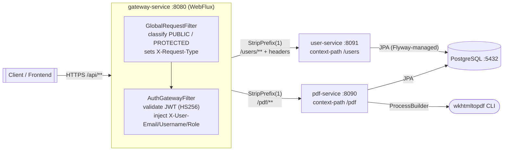
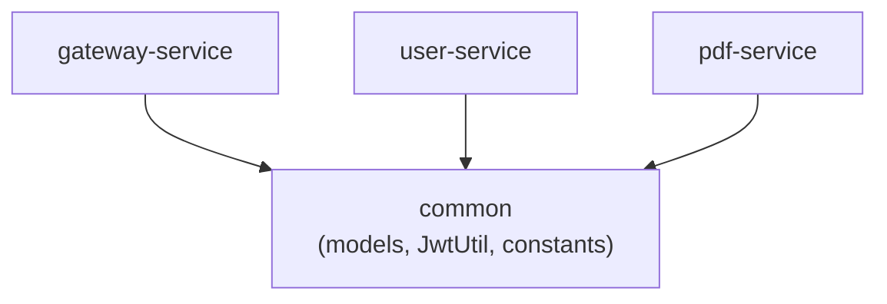
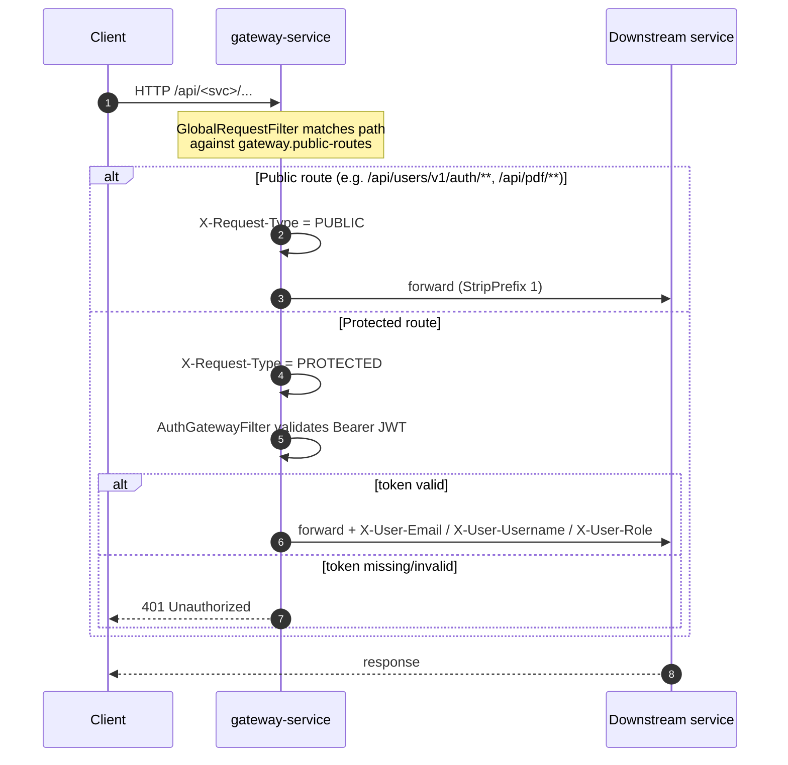

# Resume Builder Backend — Documentation

Multi-module microservices backend for building resumes and generating PDFs.
This folder holds **service-wise documentation**; each service has its own page with
architecture, flows, UML and (where applicable) an ERD.

| Service | Docs | Port | Context | Summary |
|---------|------|------|---------|---------|
| **common** | [common](./common/README.md) | — | — | Shared models, constants, `JwtUtil`, `CommonUtil`, response factory |
| **gateway-service** | [gateway-service](./gateway-service/README.md) | 8080 | — | Single entry point; routing, request classification, JWT validation |
| **user-service** | [user-service](./user-service/README.md) · [changelog](./user-service/changelog.md) | 8091 | `/users` | Identity, auth, RBAC, account lifecycle |
| **pdf-service** | [pdf-service](./pdf-service/README.md) | 8090 | `/pdf` | HTML→PDF via `wkhtmltopdf`, sync/async, persistence |

> Project README (build/run/quick-start) lives at the repo root: [`../README.md`](../README.md).
> Forward-looking plans: [`../ROADMAP.md`](../ROADMAP.md).

---

## System architecture



All external traffic flows through the gateway; downstream services are not exposed
directly in production. Services are **stateless** and trust the gateway-injected
identity headers (`X-User-*`) — they never re-validate the JWT.

### Module dependencies



---

## Request lifecycle

The gateway classifies every request, then either forwards it (public) or validates the
bearer token and enriches it with identity headers (protected).



---

## Technology stack

| Concern | Choice |
|--------|--------|
| Language / build | Java 17 · Maven (multi-module, parent POM) |
| Framework | Spring Boot 4.0.0 · Spring Cloud 2025.1.0 |
| Gateway | Spring Cloud Gateway (WebFlux, reactive) |
| Persistence | Spring Data JPA · Hibernate 7 · PostgreSQL 17 |
| Migrations | Flyway (user-service) |
| Auth | JJWT 0.13.0 (HS256) · BCrypt · gateway-validated, header-propagated identity |
| Mapping | MapStruct 1.6.3 |
| Caching | Caffeine (user-service) |
| Docs | springdoc-openapi 3.0.0, aggregated Swagger UI at the gateway |
| PDF | `wkhtmltopdf` CLI via `ProcessBuilder` |
| Local infra | `compose.yaml` (postgres:17-alpine), auto-started in `dev` |

---

## Design conventions

- **Config-driven & reusable.** Behaviour is externalized to `application-*.yml` so a
  service can be reused by changing config, not code. Examples: gateway routes
  (`gateway.service-urls`, `gateway.public-routes`), rate-limited paths
  (`app.rate-limit.limited-paths`), the email-verification gate
  (`app.auth.require-verified-email`), and the bootstrap admin (`app.bootstrap-admin.*`).
- **Profile-switched beans.** e.g. user-service email: `LoggingEmailService` (`!prod`) vs
  `SmtpEmailService` (`prod`).
- **Uniform responses.** All services return `BaseResponse` subtypes built via the shared
  `ResponseFactory` (`SUCCESS`/`FAILURE` status).
- **Gateway-trusted identity.** Downstream services read `X-User-*` headers and do not
  re-parse the JWT.

---

## Local development

```bash
# JDK 17; no Maven wrapper in this repo
docker compose up -d                       # start PostgreSQL (postgres:17-alpine)
mvn clean install -DskipTests              # build all modules

mvn -pl user-service    spring-boot:run    # :8091
mvn -pl pdf-service     spring-boot:run    # :8090
mvn -pl gateway-service spring-boot:run    # :8080  (single entry point)
```

- Aggregated Swagger UI: `http://localhost:8080/swagger-ui.html`
- In `dev`, Spring Boot's docker-compose integration auto-starts `compose.yaml`.

See each service page for its own flows, schema and configuration reference.
