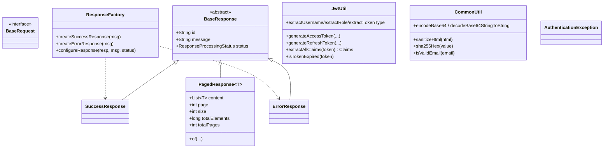

# common

Shared library used by every service (`gateway-service`, `user-service`, `pdf-service`).
No Spring Boot application — just models, constants, utilities and exceptions. Depends only on
JJWT and Lombok.

See also: [project docs](../README.md).

---

## What's inside

### Models & enums
- **`BaseRequest`** — marker interface for request DTOs.
- **`BaseResponse`** — abstract response with `id`, `message`, `status`; concrete
  `SuccessResponse` / `ErrorResponse` / `PagedResponse<T>`.
- **`ResponseProcessingStatus`** — `SUCCESS`, `FAILURE`, `PROCESSING`, `UNDEFINED`.
- **`UserRole`** — `USER`, `ADMIN`, `MODERATOR`, `GUEST`.
- **`JwtTokenType`** — `ACCESS`, `REFRESH`, `PASSWORD_RESET`, `EMAIL_VERIFICATION` (each carries a
  string `value` used as the JWT `tokenType` claim; `fromValue(...)` parses it back).

### Constants
- **`CommonConstants`** — nested holders for HTTP headers (`Headers.X_USER_EMAIL/USERNAME/ROLE/ID`),
  JWT claim keys, validation regex (email, password, base64, UUID), token-type strings, and error
  codes.
- **`ServiceIdentifiers`** — service contexts/base paths (`/users`, `/pdf`).
- **`RequestType`** — `PUBLIC` / `PROTECTED` / `UNDEFINED` (carried in `X-Request-Type`).

### Utilities
- **`JwtUtil`** — JJWT 0.13.0 wrapper (HS256): generate/parse tokens, verify signature + expiry,
  read claims (`sub`, `email`, `role`, `tokenType`). Constructed with a secret key, expirations and
  issuer, so both the gateway and user-service build it from their own config but share the
  signing secret.
- **`CommonUtil`** — HTML sanitization (strips `<script>`, `javascript:`, `data:`/`file:` URLs,
  `iframe`/`object`/`embed`), Base64 encode/decode, **`sha256Hex`** (used to hash stored tokens),
  email validation.

### Exceptions
- **`AuthenticationException`** — runtime exception for auth failures; mapped to **401** by each
  service's exception handler / the gateway's `GlobalErrorAttributes`.

---

## Conventions enforced here

- **Uniform envelopes** — every service returns a `BaseResponse` subtype via `ResponseFactory`.
- **Shared identity contract** — `CommonConstants.Headers` is the single source of truth for the
  `X-User-*` / `X-Request-Type` header names the gateway injects and services read.
- **Shared JWT semantics** — `JwtUtil` + `JwtTokenType` ensure tokens are signed and interpreted
  identically across services.
