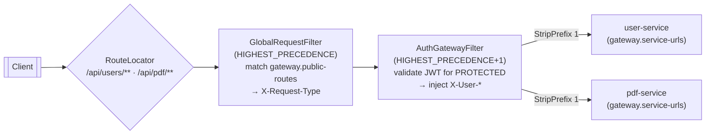
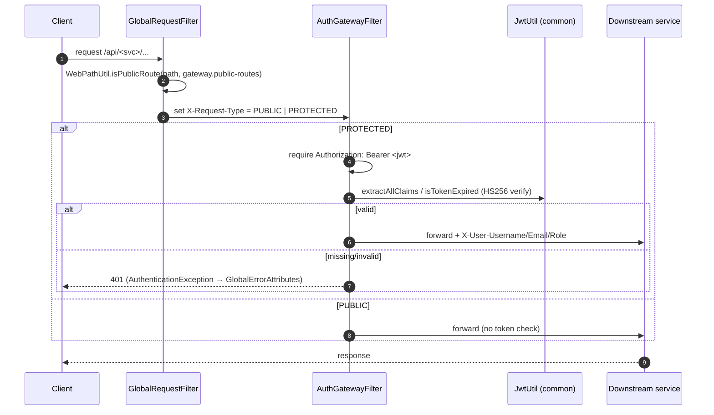
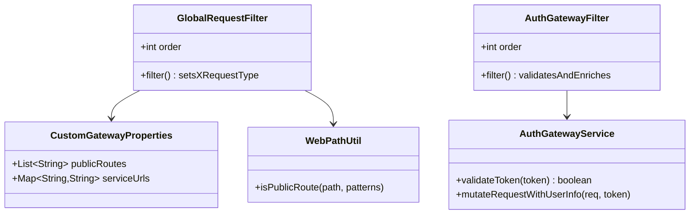

# gateway-service

**Port:** 8080 · **Stack:** Spring Cloud Gateway (WebFlux, reactive), Spring Boot 4.0.0,
Spring Cloud 2025.1.0.

The single entry point for all API traffic. It classifies each request as `PUBLIC` or
`PROTECTED`, validates JWTs for protected requests, injects identity headers for downstream
services, and aggregates each service's OpenAPI spec into one Swagger UI.

See also: [project docs](../README.md).

---

## Responsibilities

- **Routing** — forward `/api/users/**` and `/api/pdf/**` to the respective services (StripPrefix 1).
- **Request classification** — `GlobalRequestFilter` marks every request `PUBLIC`/`PROTECTED`.
- **Authentication** — `AuthGatewayFilter` validates the bearer JWT (HS256, local signature check)
  for protected requests and injects `X-User-*` headers.
- **API docs aggregation** — one Swagger UI fronting all services.

> The gateway is the only place tokens are validated; downstream services trust the injected
> `X-User-*` headers.

---

## Routing & filters



| Route | Predicate | Target (configurable) | Filters |
|-------|-----------|------------------------|---------|
| `user-service` | `/api/users/**` | `gateway.service-urls.user-service` | `StripPrefix(1)`, `AuthGatewayFilter` |
| `pdf-service` | `/api/pdf/**` | `gateway.service-urls.pdf-service` | `StripPrefix(1)`, `AuthGatewayFilter` |

Route URIs are externalized (`gateway.service-urls.*`): dev → `http://localhost:809x`,
prod → `http://user-service:8091` / `http://pdf-service:8090`.

### Authentication sequence



Claims used: `sub` → `X-User-Username`, `email` → `X-User-Email`, `role` → `X-User-Role`
(header names from `common` `CommonConstants.Headers`).

---

## Components



- Filter ordering: `GlobalRequestFilter` runs at `HIGHEST_PRECEDENCE` (tags each request with
  `X-Request-Type`), then `AuthGatewayFilter` runs at `HIGHEST_PRECEDENCE + 1` (validates the
  token and enriches the request with user info).
- `AuthGatewayServiceImpl` validates locally via the shared `common` `JwtUtil` (JJWT 0.13.0,
  HS256). `validateTokenInRemote` is a placeholder for future remote validation.
- `GlobalErrorAttributes` maps failures: `ConnectException`/DNS → 503, `AuthenticationException`
  → 401, otherwise 500 (stack traces sanitized).

---

## Configuration

```yaml
server:
  port: 8080
gateway:
  public-routes:                 # CustomGatewayProperties — config-driven, AntPath patterns
    - /api/users/v1/auth/**
    - /api/pdf/**
    - /api/users/v3/api-docs
    - /api/pdf/v3/api-docs
  service-urls:                  # downstream targets (per profile)
    user-service: http://localhost:8091   # prod: http://user-service:8091
    pdf-service:  http://localhost:8090    # prod: http://pdf-service:8090
jwt:
  secret-key: ${JWT_SECRET_KEY}  # must match user-service signing key (HS256)
  issuer: resume-builder-app
springdoc:
  swagger-ui:
    path: /swagger-ui.html
    urls:                        # aggregated downstream specs
      - { name: User Service, url: /api/users/v3/api-docs }
      - { name: PDF Service,  url: /api/pdf/v3/api-docs }
```

**Config-driven vs in-code:** route targets, public-routes, JWT secret/issuer, swagger URLs and
port are all externalized. The route *predicate patterns* (`/api/users/**`, `/api/pdf/**`), filter
ordering and `StripPrefix(1)` are defined in `GatewayConfig`. No CORS bean is configured at the
gateway (handled per-service / WebFlux defaults).

---

## Build & run

```bash
mvn -pl gateway-service spring-boot:run    # :8080
```

Swagger UI (aggregated): `http://localhost:8080/swagger-ui.html`. Requires `JWT_SECRET_KEY` to
match the user-service signing key so issued tokens verify at the gateway.
