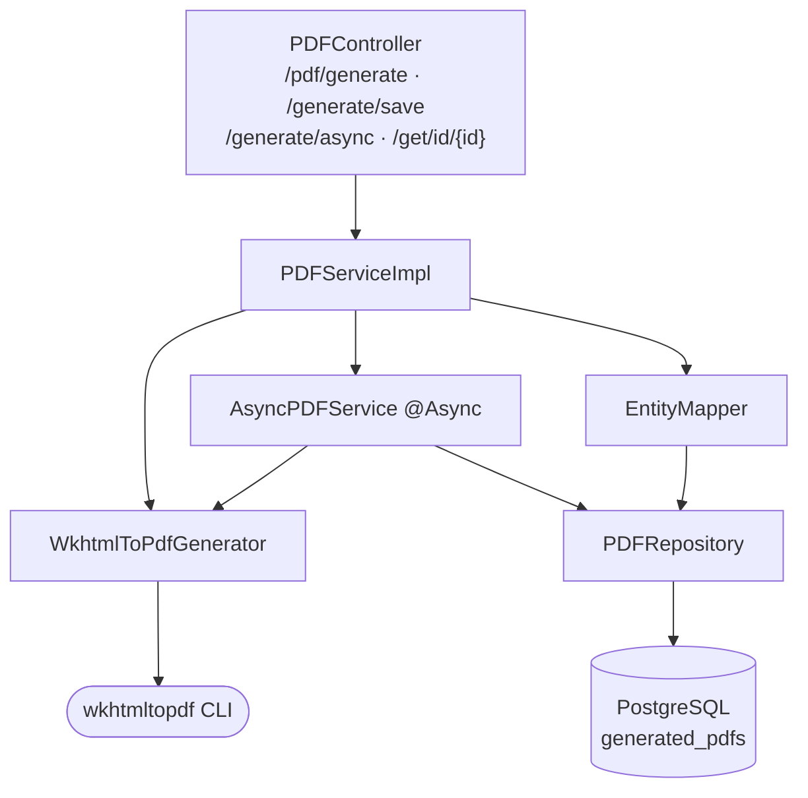
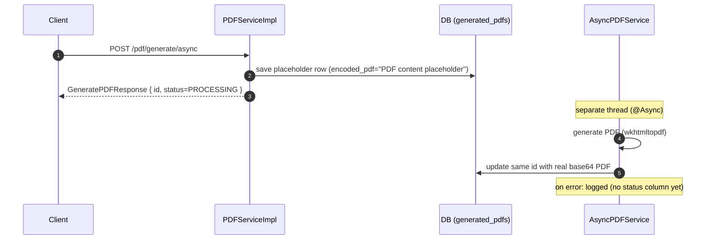
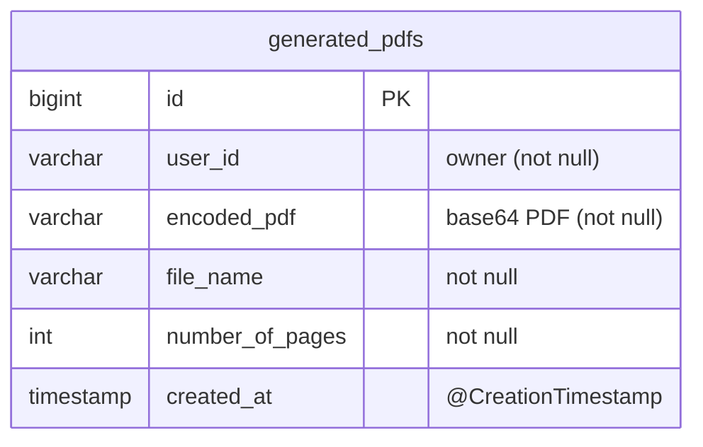
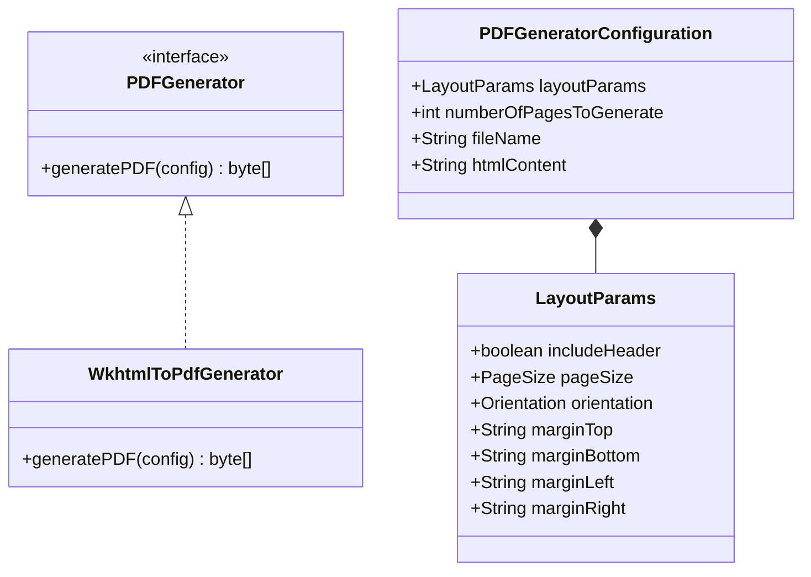

# pdf-service

**Port:** 8090 · **Context-path:** `/pdf` · **Gateway prefix:** `/api/pdf/...`
**Stack:** Java 17, Spring Boot 4.0.0, Spring Data JPA, PostgreSQL, `wkhtmltopdf` CLI.

Generates PDFs from HTML content (resumes) using the `wkhtmltopdf` binary, with synchronous,
persisted and asynchronous variants. Public in dev (routed through the gateway without auth).

See also: [project docs](../README.md).

---

## Capabilities

- Synchronous HTML→PDF generation (returns base64)
- Generate **and persist** to the database
- **Asynchronous** generation (`@EnableAsync`) — returns immediately, writes the PDF in a worker
- Retrieve a stored PDF by id
- HTML sanitization (XSS protection via `common` `CommonUtil`)
- Configurable layout (page size, orientation, margins)

---

## Architecture



`PDFServiceImpl` sanitizes/decodes HTML, builds a `PDFGeneratorConfiguration` (default
`LayoutParams`), invokes the generator, base64-encodes the bytes, and (for save/async) persists
via `PDFRepository`.

---

## API

All endpoints are reached through the gateway at `/api/pdf/...` (controller paths below include
the `/pdf` context-path). Requests/responses extend the shared `BaseResponse`.

| Method | Path | Request | Returns | Description |
|--------|------|---------|---------|-------------|
| POST | `/pdf/generate` | `GeneratePDFRequest` | `GeneratePDFResponse` | Sync generate; base64 PDF in `content` |
| POST | `/pdf/generate/save` | `GenerateAndSavePDFRequest` | `GeneratePDFResponse` | Sync generate + persist; returns saved metadata |
| POST | `/pdf/generate/async` | `GenerateAndSavePDFRequest` | `GeneratePDFResponse` | Pre-saves a placeholder row, returns `PROCESSING` + id |
| GET | `/pdf/get/id/{id}` | — | `GeneratePDFResponse` | Retrieve stored PDF by id |

**Requests:** `GeneratePDFRequest { content (base64 HTML), fileName, numberOfPages≥1 }`;
`GenerateAndSavePDFRequest extends GeneratePDFRequest { userId }`.
**Response:** `GeneratePDFResponse extends BaseResponse { content (base64 PDF), fileName }`.

### Synchronous generation

```mermaid
sequenceDiagram
    autonumber
    participant C as Client
    participant S as PDFServiceImpl
    participant G as WkhtmlToPdfGenerator
    participant WK as wkhtmltopdf
    C->>S: POST /pdf/generate (base64 HTML)
    S->>S: base64-decode + sanitize HTML, clean fileName
    S->>S: build PDFGeneratorConfiguration (LayoutParams)
    S->>G: generatePDF(config)
    G->>G: write {tmp}/{file}.html
    G->>WK: ProcessBuilder: wkhtmltopdf --page-size --margin-* in.html out.pdf
    WK-->>G: out.pdf
    G->>G: read bytes; delete temp files (finally)
    G-->>S: byte[]
    S-->>C: GeneratePDFResponse { content=base64(pdf), status=SUCCESS }
```

### Asynchronous generation



> The async executor is Spring's default `SimpleAsyncTaskExecutor` (no custom pool). The entity has
> no status column, so async progress is inferred by fetching the row by id. See the
> [roadmap](../../ROADMAP.md) for planned status tracking and a process timeout.

---

## Data model (ERD)



Single table `generated_pdfs`; `PDFRepository` is a plain `JpaRepository` (inherited CRUD only).
`EntityMapper` maps request+response→entity, request→placeholder entity, and entity→response.
DDL is Hibernate-managed (`ddl-auto`: `create` in dev, `update` in prod) — **no Flyway yet**.

---

## Generator & layout



`PageSize` covers A0–A9, B0–B10, C5E, COMM10E, DLE, EXECUTIVE, FOLIO, LEDGER, LEGAL, LETTER,
TABLOID. Layout defaults are currently **hardcoded** in `LayoutParams` (`includeHeader=false`,
`pageSize=A4`, `orientation=PORTRAIT`, margins `6mm` top/bottom and `8mm` left/right) — a
candidate for externalization (see roadmap).

---

## Configuration

```yaml
server:
  servlet.context-path: /pdf
  port: 8090
spring:
  datasource: { url, username, password, driver-class-name: org.postgresql.Driver }
  jpa:
    database-platform: org.hibernate.dialect.PostgreSQLDialect
    hibernate.ddl-auto: create      # dev (prod: update)
```

Notes: dev auto-starts Postgres via `spring.docker.compose` (`../compose.yaml`); prod is env-driven
(`DATABASE_URL/USERNAME/PASSWORD`). No app-specific properties yet (the `wkhtmltopdf` path, process
timeout and layout defaults are not externalized). `PDFException` currently maps to HTTP 200 with a
`FAILURE` body in `GlobalExceptionHandler` (non-standard; see roadmap).

---

## Prerequisites & run

```bash
# wkhtmltopdf must be installed and on PATH
wkhtmltopdf --version
mvn -pl pdf-service spring-boot:run        # :8090
```

Swagger is aggregated at the gateway (`/api/pdf/v3/api-docs`).
