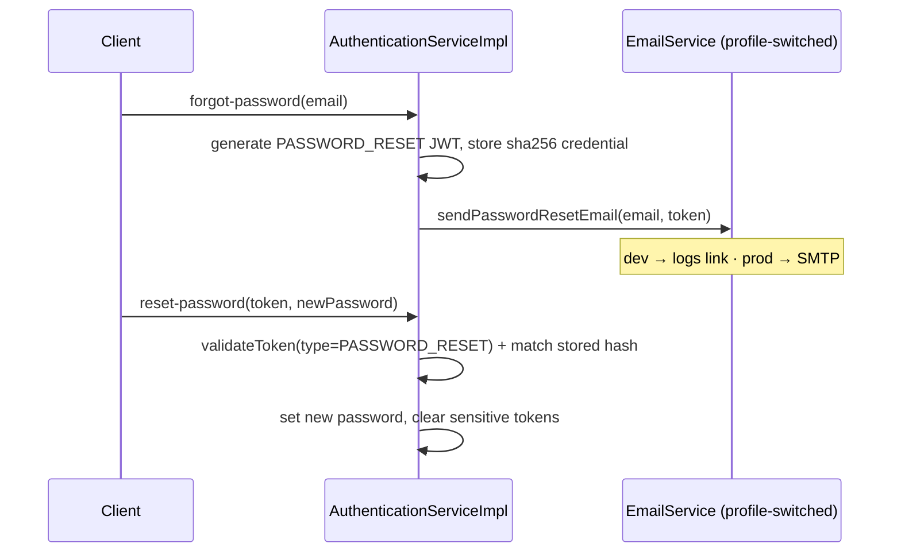

# User Service — Design Document

**Module:** `user-service` · **Stack:** Java 17, Spring Boot 4.0.0 (Spring 7 / Hibernate 7 / Tomcat 11), PostgreSQL
**Status:** feature-complete (see [Verification](#verification-status))

This document describes the design of the user-service after the completion work that took it from
"under development" to feature-complete. It complements [`Project.md`](./Project.md) (whole-system
overview) and [`user-service-changelog.md`](./user-service-changelog.md) (what changed + migration notes).

---

## 1. Overview & responsibilities

`user-service` owns user identity, authentication, authorization, and account lifecycle. It sits
behind `gateway-service`, which terminates client traffic, marks each request `PUBLIC`/`PROTECTED`
(`X-Request-Type`) and injects `X-User-Email` / `X-User-Role` for validated tokens.

Capabilities:

- Registration, login, JWT access/refresh, logout
- Password reset & email verification (with real, profile-switched email delivery)
- Profile CRUD, admin user listing (paginated), soft delete
- Role-based access control (RBAC)
- Account security: BCrypt passwords, login-attempt lockout, hashed token storage, rate limiting
- Security audit trail
- OpenAPI/Swagger documentation

### Already in place before this work (on `user-service-refactor`)
The "god object" `UserEntity` was already split into `UserProfile` / `UserAccountStatus` /
`UserCredential`; N+1 was solved with LAZY associations + tiered fetch-join repository methods;
auth config was externalized into `@ConfigurationProperties` records (`AuthConfigValues`,
`JwtConfig`, `CorsProperties`); and the redundant facade layer was collapsed into
`AuthenticationServiceImpl`. This document focuses on the subsystems completed on top of that.

---

## 2. Architecture

```
Client ──HTTPS──▶ gateway-service (:8080)
                    │  GlobalRequestFilter → X-Request-Type = PUBLIC|PROTECTED
                    │  AuthGatewayFilter   → validates JWT, injects X-User-Email/Role
                    │  StripPrefix(1)
                    ▼
              user-service (:8091, context-path /users)
                    │
   ┌────────────────┼─────────────────────────────────────────────┐
   │ web            │ controller/  (AuthenticationController,        │
   │                │   UserController, AuthorizationController)     │
   │                │ + RateLimitFilter (OncePerRequestFilter)       │
   ├────────────────┼─────────────────────────────────────────────┤
   │ service        │ AuthenticationServiceImpl, UserServiceImpl,    │
   │                │ AuthorizationServiceImpl, JwtServiceImpl,       │
   │                │ Password/Email services, AuditService           │
   ├────────────────┼─────────────────────────────────────────────┤
   │ persistence    │ UserRepository, AuditEventRepository           │
   │                │ entities: UserEntity, UserProfile,             │
   │                │ UserAccountStatus, UserCredential, AuditEvent   │
   └────────────────┴─────────────────────────────────────────────┘
                    ▼
              PostgreSQL (:5432)   ◀── local: compose.yaml (auto-started in dev)
```

Cross-cutting: `@ConfigurationPropertiesScan` (on `UserServiceApplication`) binds all `app.*` config
records; `@EnableCaching` (Caffeine); springdoc serves `/users/swagger-ui.html`.

---

## 3. API surface (versioned)

All paths are versioned under `/v1` and reached through the gateway as `/api/users/v1/...`
(gateway strips the leading `/api`; service context-path is `/users`).

| Method | Gateway path | Access | Purpose |
|--------|--------------|--------|---------|
| POST | `/api/users/v1/auth/register` | public | Register (issues tokens + sends verification email) |
| POST | `/api/users/v1/auth/authenticate` | public · **rate-limited** | Login |
| POST | `/api/users/v1/auth/refresh-token` | public | New access token from refresh token |
| POST | `/api/users/v1/auth/logout` | public | Invalidate token |
| POST | `/api/users/v1/auth/forgot-password` | public · **rate-limited** | Send reset link |
| POST | `/api/users/v1/auth/reset-password` | public | Complete reset |
| POST | `/api/users/v1/auth/verify-email` | public | Verify email |
| GET | `/api/users/v1/me` | protected | Current profile |
| PUT | `/api/users/v1/me` · `/me/password` | protected | Update profile / password |
| DELETE | `/api/users/v1/me` | protected | Soft-delete self |
| GET | `/api/users/v1/all?page&size&sort` | admin | Paginated user list |
| GET/PUT/DELETE | `/api/users/v1/{id|username}` | admin | Admin user ops |
| GET | `/api/users/v1/authorize/check?resource&action` | protected | Permission check |
| GET | `/api/users/v1/authorize/roles`, `/permissions`, `/{userId}` | admin | RBAC introspection |
| POST | `/api/users/v1/authorize/roles/{userId}` | admin | Assign role |
| GET | `/api/users/v1/authorize/me/permissions` | protected | Caller's permissions |

Only `/api/users/v1/auth/**` is configured as a public route on the gateway; everything else is
`PROTECTED`. Admin endpoints additionally enforce `ADMIN` via `AuthTokenService.verifyRole(...)`.

---

## 4. Subsystem designs

### 4.1 Token storage & hashing  *(security)*

**Problem.** Refresh/reset/verification tokens were stored in plaintext in `user_credentials.token`
— a DB leak would expose usable tokens.

**Design.** Tokens are stored as a **SHA-256 hex digest** (`CommonUtil.sha256Hex`,
`user_credentials.token` is now `varchar(64)`). SHA-256 is chosen over BCrypt deliberately:

- **Deterministic** → the existing "look up the credential by token" pattern still works: hash the
  incoming token and compare. BCrypt is salted (non-deterministic) and would force a scan + per-row
  `checkpw`.
- BCrypt also silently truncates inputs beyond 72 bytes — JWTs are far longer.

Because the credential only holds a hash, it can no longer be the carrier of the raw JWT for the
HTTP response. The raw tokens for the *current operation* are carried on two `@Transient` fields of
`UserEntity` (`plainAccessToken`, `plainRefreshToken`), populated by `AuthenticationServiceImpl` and
read by `AuthResponseBuilder` (which derives `expiresIn` from the raw JWT via `AuthTokenService`).
Both transient fields are excluded from `@ToString`/`@EqualsAndHashCode` so tokens never leak to logs.

**Key files:** `common/.../CommonUtil.sha256Hex`, `entity/UserCredential`, `entity/UserEntity`,
`service/impl/AuthenticationServiceImpl` (`buildUserCredential`, lookups in
`refreshToken`/`logout`/`resetPassword`), `utils/AuthResponseBuilder`.

```mermaid
sequenceDiagram
    participant C as Client
    participant A as AuthenticationServiceImpl
    participant DB as DB (user_credentials)
    C->>A: login(email, password)
    A->>A: generate refresh+access JWTs
    A->>DB: save credential.token = sha256(jwt)
    A-->>C: AuthResponse { accessToken=<raw jwt>, refreshToken=<raw jwt> }
    Note over A,C: raw JWTs via @Transient fields; DB only has hashes
    C->>A: refresh(refreshToken)
    A->>DB: find credential where token = sha256(refreshToken)
    A-->>C: new access token
```

### 4.2 Account security & lockout

`UserAccountStatus` tracks `failedLoginAttempts`, `accountLockedUntil`, `lastLoginAt`. On a bad
password, attempts increment; at `app.auth.max-failed-login-attempts` the account locks for
`account-lock-duration-minutes`. On success, attempts reset and `lastLoginAt` is recorded.

**Critical fix.** `authenticate` is transactional and throws `AuthenticationException` on failure —
which by default **rolls back** the failed-attempt increment, so accounts never actually locked. The
method is now annotated `@Transactional(noRollbackFor = AuthenticationException.class)` so the
increment/lock commits while the exception still propagates. Tokens are also bound to a purpose:
`JwtServiceImpl.validateToken` checks both expiry **and** token type, so an access token can't be
used to reset a password.

### 4.3 Soft delete

`UserEntity` carries `deletedAt` and is annotated `@SQLRestriction("deleted_at IS NULL")` (Hibernate
6/7 replacement for the deprecated `@Where`). `deleteUser` sets the timestamp; thereafter the row is
invisible to all standard queries (including fetch-joins). The marker lives on the aggregate root
(`users` table), not the child status entity, so the restriction can filter at the user level.

> Trade-off: a soft-deleted row still occupies its unique `username`/`email`. Re-registering the same
> identity would need a dedicated policy (purge or rename on delete) — out of scope. An admin
> "include deleted" view would require a native query that bypasses `@SQLRestriction`.

### 4.4 Transaction management

`UserServiceImpl` is `@Transactional` at class level with `@Transactional(readOnly = true)` on all
reads (boot/`*WithDetails`/`*WithCredentials`/exists). `AuditService` uses
`@Transactional(REQUIRES_NEW)` (see §4.9) and `authenticate` uses `noRollbackFor` (see §4.2).

### 4.5 Email — profile-switched

`EmailService` has two implementations selected by Spring profile, guaranteeing exactly one active
bean:

- **`LoggingEmailService`** — `@Profile("!prod")`: logs the verification/reset link. Lets the full
  flows run in dev with no SMTP credentials.
- **`SmtpEmailService`** — `@Profile("prod")`: `JavaMailSender` + `MimeMessageHelper`; failures are
  logged and returned as `false`, never thrown.

`MailProperties` (`app.mail.*`) provides the sender identity and builds the links
(`frontendBaseUrl + path + token`); SMTP transport is `spring.mail.*` (prod, env-driven). The flows
were also completed so they actually work: `forgotPassword` now persists the (hashed) reset-token
credential, `register` issues and emails a verification token, and `verifyEmail` flips
`emailVerified`.



### 4.6 Authorization / RBAC

A static, in-code model (no DB table): `Permission` enum (`RESOURCE_ACTION` naming) and
`RolePermissions` (role → permission set; `ADMIN` = all, `MODERATOR`/`USER` = subsets,
`GUEST` = `PDF_READ`). `AuthorizationServiceImpl` resolves and checks permissions and assigns roles;
`AuthorizationController` (now enabled) exposes the endpoints, guarding admin operations with
`verifyRole(authHeader, ADMIN)` and returning the flexible `AuthorizationResponse` DTO via
`ResponseFactory`. A `(resource, action)` check maps to a permission through `Permission.from(...)`.

### 4.7 Rate limiting

A **dependency-free** fixed-window limiter (`FixedWindowRateLimiter`, a `ConcurrentHashMap` of
per-key counters reset each window) applied by `RateLimitFilter` (`OncePerRequestFilter`) to
`/auth/authenticate` and `/auth/forgot-password`, keyed by client IP (`X-Forwarded-For` →
`remoteAddr`). Over-limit requests get HTTP 429 with a JSON error body. Configured via
`app.rate-limit.*` (`enabled`, `capacity`, `window-seconds`).

> Bucket4j's Spring Boot starter was intentionally avoided for Spring Boot 4 compatibility. This
> limiter is per-instance; a multi-node deployment should back it with Redis.

### 4.8 Pagination

`UserService.getAllUsers(Pageable)` → `UserRepository.findAll(pageable)` (soft-delete filter applies
automatically). `GET /v1/all` is admin-only, uses Spring Data's `@PageableDefault(size = 20)`
resolver, and returns `Page<UserDTO>` mapped via `UserMapper`.

### 4.9 Audit logging

`AuditEvent` (`audit_events` table, indexed on `user_id`/`event_type`/`created_at`) records security
events (`AuditEventType`: register, login success/failed, lockout, refresh, logout, password reset
requested/completed, email verified, role assigned, profile updated). `AuditService.log(...)` runs
in a **`REQUIRES_NEW`** transaction so an event persists even when the business transaction rolls
back (e.g. `LOGIN_FAILED`), and it resolves IP/User-Agent from the current request via
`RequestContextHolder`. Audit failures are swallowed (logged) so they can never break the primary
flow.

### 4.10 Caching

Caffeine-backed `users` cache (`CacheConfig`, 5-min TTL, max 1000). `getUserByUsername` is
`@Cacheable`; mutations evict (`updateUser`/`assignRole` → all entries; `deleteUser`/`updatePassword`
→ by key). Only the eagerly-loaded top-level fields are relied upon by cache-hit callers (profile
mapping, role checks) — lazy associations are not traversed on a hit, avoiding
`LazyInitializationException`.

### 4.11 OpenAPI / Swagger

springdoc-openapi **3.0.0** (the Spring Boot 4 line; 2.x targets Boot 3 and is incompatible).
`OpenAPIConfig` declares a bearer-JWT security scheme; controllers are grouped with `@Tag`. UI:
`http://localhost:8091/users/swagger-ui.html`; spec: `/users/v3/api-docs`.

### 4.12 Database containerization

Root `compose.yaml` runs `postgres:17-alpine` (matching the dev datasource) with a named volume and
healthcheck, plus an optional `pgadmin` under the `tools` profile. `spring-boot-docker-compose`
(a `developmentOnly` dependency) auto-starts it in the `dev` profile
(`spring.docker.compose.file=../compose.yaml`, `lifecycle-management=start-only`).

---

## 5. Data model (schema additions)

| Table | Change |
|-------|--------|
| `users` | **+ `deleted_at timestamp`** (soft-delete marker; `@SQLRestriction`) |
| `user_credentials` | `token` resized **`varchar(2048)` → `varchar(64)`** (now a SHA-256 hex hash) |
| `user_account_status` | **− `deleted_at`** (moved to `users`) |
| `audit_events` | **new**: `id, user_id, event_type, ip_address, user_agent, details, created_at` (+3 indexes) |

`UserEntity.plainAccessToken` / `plainRefreshToken` are `@Transient` — not columns.

---

## 6. Configuration reference (new keys)

```yaml
app:
  mail:                       # MailProperties
    from-address: ...
    frontend-base-url: ...    # base for verification/reset links
    verification-path: /verify-email?token=
    password-reset-path: /reset-password?token=
    verification-subject: ...
    password-reset-subject: ...
  rate-limit:                 # RateLimitProperties
    enabled: true
    capacity: 5               # dev=5, prod=10
    window-seconds: 60
spring:
  docker:                     # dev only — auto-start Postgres
    compose:
      enabled: true
      file: ../compose.yaml
      lifecycle-management: start-only
  mail:                       # prod only — SMTP transport (env-driven)
    host: ${MAIL_HOST}
    port: ${MAIL_PORT:587}
    username: ${MAIL_USERNAME}
    password: ${MAIL_PASSWORD}
```
Existing `app.auth.*` (max attempts, lock duration, JWT) are unchanged.

---

## 7. Security considerations

- Tokens are hashed at rest; raw JWTs exist only in responses and transient fields.
- Reset/verification tokens are bound to their purpose (type-checked) and single-use (cleared on use).
- Login is rate-limited and accounts lock after repeated failures (lockout now actually persists).
- Audit trail captures auth events with IP/User-Agent, independent of business-transaction rollback.
- Soft delete hides users from queries (note the unique-constraint trade-off in §4.3).

---

## 8. Build & run

```bash
# JDK 17 (no Maven wrapper in this repo)
export JAVA_HOME=/home/tu2l/.jdks/ms-17.0.15
mvn clean install                     # build all modules
docker compose up -d                  # start Postgres (or rely on dev auto-start)
mvn -pl user-service spring-boot:run  # :8091 (+ run gateway-service for :8080)
```
Exercise the API with `etc/requests/user-service.http`. Swagger UI at
`http://localhost:8091/users/swagger-ui.html`.

---

## 9. Verification status

Verified: full multi-module build; Spring context boot; generated schema (hashed-token column,
`users.deleted_at`, `audit_events`); rate-limiting returns 429; Swagger UI + `/v3/api-docs` serve;
register persists user + profile + status + 3 hashed credentials. Live HTTP flows that exercise the
`REQUIRES_NEW` audit path require PostgreSQL (the in-memory SQLite smoke harness is single-writer and
cannot model a second concurrent connection).

---

## 10. Out of scope / future work

Not included (review "future enhancements"): automated tests, session-management UI, 2FA, advanced
password policies, distributed (Redis) token blacklist, metrics/monitoring. Production also needs a
schema migration tool (Flyway/Liquibase) since prod runs `ddl-auto: validate` — see the changelog.
