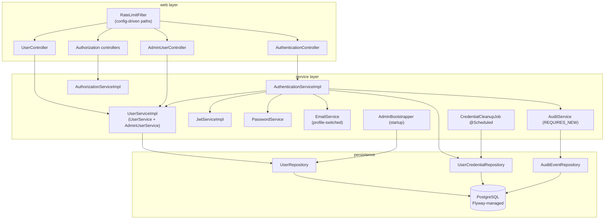
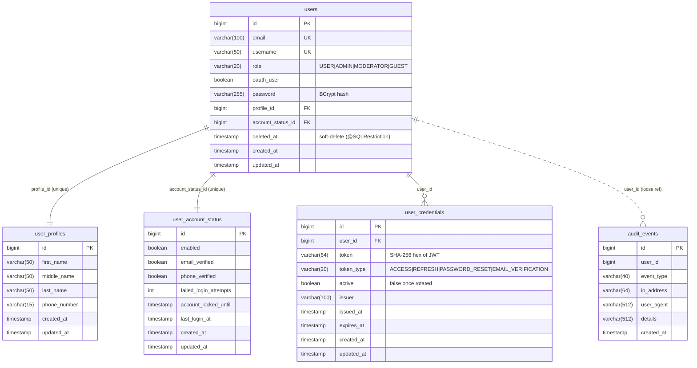
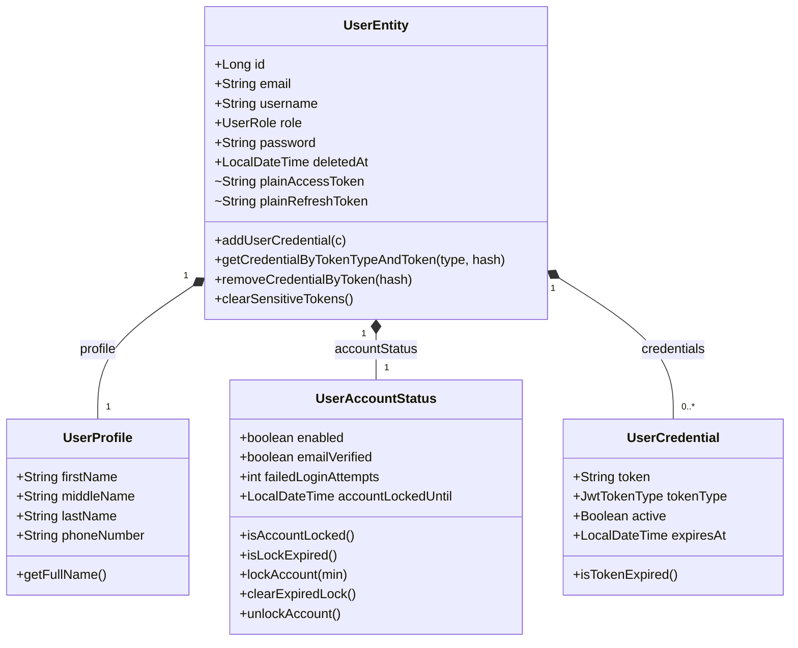
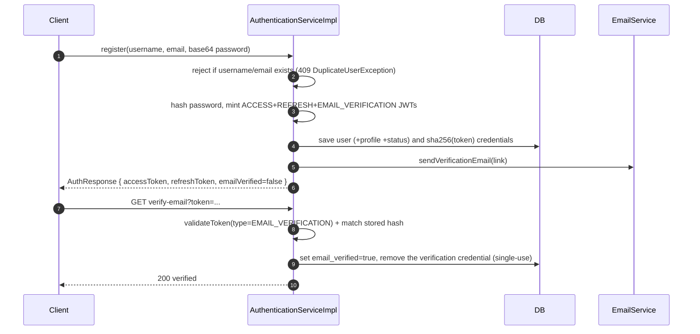
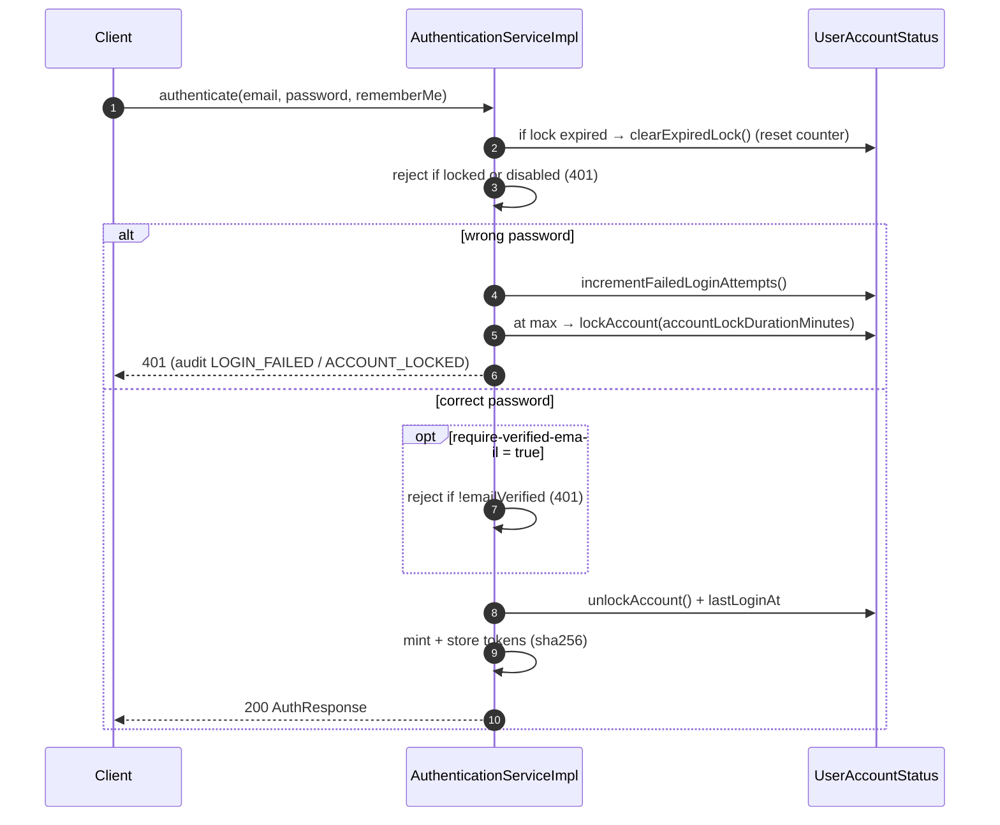
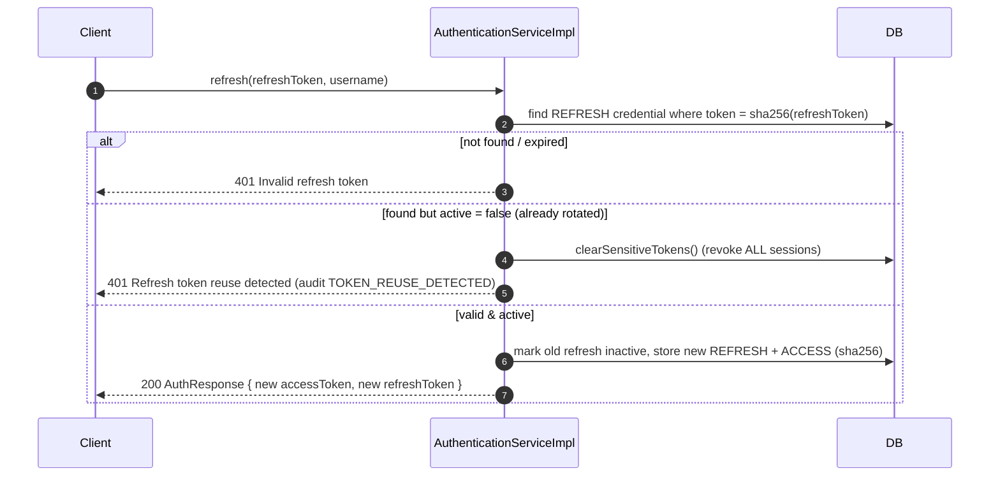
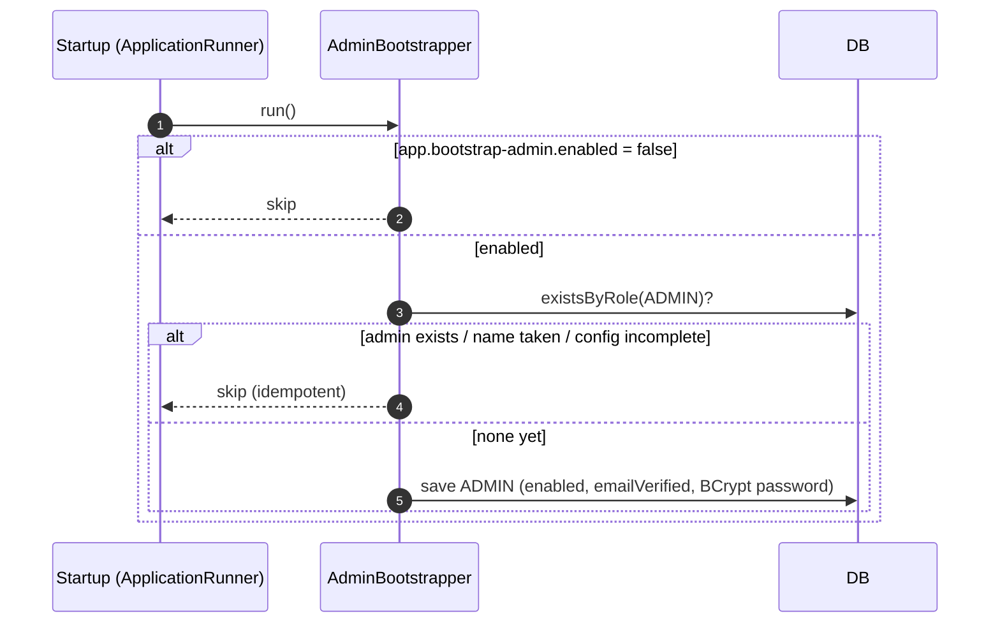

# user-service

**Port:** 8091 · **Context-path:** `/users` · **Gateway prefix:** `/api/users/v1/...`
**Stack:** Java 17, Spring Boot 4.0.0 (Spring 7 / Hibernate 7 / Tomcat 11), PostgreSQL, Flyway.

Owns user **identity, authentication, authorization and account lifecycle**. It sits behind
`gateway-service`, which marks each request `PUBLIC`/`PROTECTED` (`X-Request-Type`) and injects
`X-User-Email` / `X-User-Username` / `X-User-Role` for validated tokens.

See also: [changelog](./changelog.md) · [project docs](../README.md).

---

## Capabilities

- Registration, login, JWT access/refresh, logout
- **Refresh-token rotation** with reuse detection (revokes all sessions on replay)
- Password reset & email verification (single-use tokens; profile-switched email delivery)
- Optional **email-verification gate** at login (`app.auth.require-verified-email`)
- Profile CRUD, admin user listing (paginated), soft delete
- Role-based access control (RBAC)
- Admin account ops: unlock, enable/disable; **bootstrap admin** seeding
- Account security: BCrypt, login-attempt lockout, SHA-256 hashed token storage, config-driven rate limiting
- Scheduled credential cleanup; security audit trail; Caffeine caching; OpenAPI
- Operability: Actuator health/liveness/readiness probes, graceful shutdown, MDC request-correlation logging

---

## Architecture



Cross-cutting: `@ConfigurationPropertiesScan` binds all `app.*` records; `@EnableScheduling`
drives cleanup; `@EnableCaching` (Caffeine `users` cache); `CorrelationIdFilter` puts a
per-request id in MDC; springdoc serves the OpenAPI spec at `/users/v1/api-docs` (Swagger UI is
disabled here and aggregated by the gateway). Actuator exposes `health`/`info` on the app port.

---

## Data model (ERD)



The schema is owned by **Flyway**: `V1__baseline.sql` plus `V2__add_password_changed_audit_event.sql`
(which extends the `audit_events.event_type` CHECK constraint with `PASSWORD_CHANGED`). `ddl-auto` is
`validate` in dev and prod. `users.deleted_at` drives soft delete via `@SQLRestriction("deleted_at IS NULL")`.

### Entity relationships (UML)



---

## API surface

All paths are versioned under `/v1` and reached through the gateway as `/api/users/v1/...`.
Only `/api/users/v1/auth/**` is public; everything else is `PROTECTED`. Admin endpoints
additionally enforce `ADMIN` (header role check / `AuthTokenService.verifyRole`).

> **API versioning is framework-managed (Spring Framework 7 native).** The `/v1` segment is no
> longer hardcoded into each `@RequestMapping`; instead `ApiVersioningConfiguration` adds a global
> `/{version}` path prefix and resolves the version from path-segment 0 (`usePathSegment(0)`),
> while controllers declare `version = "1+"` (a baseline that keeps serving future versions until
> explicitly overridden). The shared `common` `PrefixedSemanticApiVersionParser` strips the leading
> `v` so `v1` is compared semantically. Resolution is lenient — a missing version defaults to `1`;
> an unknown version (e.g. `/v2/...`) returns **400** via `GlobalExceptionHandler`'s
> `ResponseStatusException` handler. URLs are unchanged from the previous hardcoded scheme.
>
> ⚠️ **`usePathSegment(0)` validates segment 0 of _every_ request** through
> `RequestMappingHandlerMapping`, including SpringDoc — not just controller routes. So the OpenAPI
> path must sit under a *supported* version: it is `/v1/api-docs` (`v1` → `1`, supported), **not**
> SpringDoc's default `/v3/api-docs` (`3` → unsupported → 400) or a non-version path like `/openapi`
> (not parseable as a version → 400). Actuator (`/actuator/**`) is served by a separate
> `WebMvcEndpointHandlerMapping` and is unaffected.

| Method | Gateway path | Access | Purpose |
|--------|--------------|--------|---------|
| POST | `/api/users/v1/auth/register` | public · rate-limited | Register (issues tokens + sends verification email) |
| POST | `/api/users/v1/auth/authenticate` | public · rate-limited | Login |
| POST | `/api/users/v1/auth/refresh-token` | public · rate-limited | Rotate tokens |
| POST | `/api/users/v1/auth/logout` | public | Invalidate token |
| POST | `/api/users/v1/auth/forgot-password` | public · rate-limited | Send reset link (enumeration-safe) |
| POST | `/api/users/v1/auth/reset-password` | public · rate-limited | Complete reset |
| GET | `/api/users/v1/auth/verify-email?token=` | public | Verify email (single-use) |
| POST | `/api/users/v1/auth/resend-verification` | public | Resend verification (enumeration-safe) |
| GET | `/api/users/v1/me` | protected | Current profile |
| PUT | `/api/users/v1/me` · `/me/password` | protected | Update profile / password |
| DELETE | `/api/users/v1/me` | protected | Soft-delete self |
| GET | `/api/users/v1/admin/users?page&size` | admin | Paginated user list |
| GET/PUT/DELETE | `/api/users/v1/admin/users/{id\|username}` | admin | Admin user ops |
| POST | `/api/users/v1/admin/users/{id}/unlock` | admin | Clear lock + reset attempts |
| PATCH | `/api/users/v1/admin/users/{id}/enabled?enabled=` | admin | Enable/disable account |
| GET/POST | `/api/users/v1/authorize/...` | protected/admin | RBAC introspection & role assignment |

---

## Key flows

### Registration → email verification



### Login: lockout + optional verification gate



> The lockout transaction is annotated `@Transactional(noRollbackFor = AuthenticationException.class)`
> so the failed-attempt increment persists despite the thrown exception.

### Refresh-token rotation + reuse detection



### Token storage (hashing)

Tokens are stored as a **SHA-256 hex digest** (`user_credentials.token varchar(64)`), chosen
over BCrypt because lookups are deterministic ("hash the incoming token and compare") and BCrypt
truncates >72 bytes. The raw JWT for the current operation rides on two `@Transient` fields of
`UserEntity` (`plainAccessToken`/`plainRefreshToken`), read by `AuthResponseBuilder`; both are
excluded from `@ToString`/`@EqualsAndHashCode` so tokens never reach logs.

### Bootstrap admin (startup)



---

## Subsystem notes

- **RBAC** — static in-code model: `Permission` enum + `RolePermissions` (ADMIN=all,
  MODERATOR/USER subsets, GUEST=`PDF_READ`). `(resource, action)` → `Permission.from(...)`.
- **Rate limiting** — dependency-free, in-process fixed-window limiter (`FixedWindowRateLimiter`)
  applied by `RateLimitFilter`; **paths, capacity, window and cleanup interval are all config**
  (`app.rate-limit.*`). A `@Scheduled` sweep evicts stale windows (bounded memory). Keyed by client
  IP via the shared `ClientIpResolver`, which honours `X-Forwarded-For` **only** from configured
  `app.rate-limit.trusted-proxies` (the gateway) to prevent spoofing. The limiter is per-instance by
  design — the deployment target is a single VM; a Redis-backed variant was prototyped and removed as
  unnecessary (it also added a fail-closed dependency on the auth path).
- **Credential lifecycle** — `CredentialCleanupJob` (`@Scheduled`) purges expired credentials via
  `UserCredentialRepository.deleteByExpiresAtBefore`; rotated-but-unexpired refresh tokens are kept
  (`active=false`) so reuse detection still works.
- **Errors** — `UserException` carries an `HttpStatus`; `UserNotFoundException` → 404,
  `DuplicateUserException` → 409, others → 400 (`GlobalExceptionHandler`).
- **Email** — `LoggingEmailService` (`!prod`) logs links; `SmtpEmailService` (`prod`) sends via SMTP.
- **Audit** — `AuditService.log` runs `REQUIRES_NEW` so events persist even when the business
  transaction rolls back (e.g. `LOGIN_FAILED`). Client IP is resolved via the same trusted-proxy
  `ClientIpResolver` as the rate limiter. Self-service password change emits `PASSWORD_CHANGED`.
- **Caching** — Caffeine `users` cache (5-min TTL); mutations evict. In-process (single VM).
- **Observability** — `CorrelationIdFilter` reads/generates `X-Correlation-Id`, stores it in MDC as
  `requestId`, and echoes it back; `logging.pattern.level` includes `%X{requestId}` so it appears on
  every log line. Actuator exposes `health` (with liveness/readiness probes) and `info`.
- **Lifecycle/secrets** — graceful shutdown (`server.shutdown: graceful`) drains in-flight requests.
  No profile is pinned in `application.yml`: the `spring-boot-maven-plugin` activates `dev` for local
  runs, so a prod deploy that forgets `SPRING_PROFILES_ACTIVE=prod` fails fast on a missing datasource
  rather than booting dev with its weak fallback secret and seeded admin.

---

## Configuration reference (`app.*`)

```yaml
app:
  auth:
    max-failed-login-attempts: 5
    account-lock-duration-minutes: 15
    remember-me-token-validity-minutes: 14
    require-verified-email: false        # gate login on verified email
    jwt:
      secret-key: ${JWT_SECRET_KEY}
      access-token-expiration-minutes: 15
      refresh-token-expiration-days: 7
      issuer: resume-builder-app
  rate-limit:
    enabled: true
    capacity: 5                          # dev=5, prod=10
    window-seconds: 60
    cleanup-interval-ms: 300000
    limited-paths:                       # config-driven; no hardcoded suffixes
      - /auth/authenticate
      - /auth/forgot-password
      - /auth/reset-password
      - /auth/register
      - /auth/refresh
    trusted-proxies: ${RATE_LIMIT_TRUSTED_PROXIES:}  # IPs whose X-Forwarded-For is trusted (the gateway)
  mail:                                  # MailProperties (link building)
    from-address: ...
    frontend-base-url: ...
    verification-path: /verify-email?token=
    password-reset-path: /reset-password?token=
  bootstrap-admin:                       # seed first admin if none exists
    enabled: true                        # dev=true; prod gated on BOOTSTRAP_ADMIN_ENABLED
    username: admin
    email: admin@resume-builder.local
    password: Admin@12345
spring:
  jpa.hibernate.ddl-auto: validate       # Flyway owns the schema
  flyway: { enabled: true, baseline-on-migrate: true }
  mail: { host, port, username, password }   # prod SMTP transport (env-driven)
  # NOTE: no spring.profiles.active pinned here — see "Lifecycle/secrets" above.
server:
  shutdown: graceful                       # drain in-flight requests on shutdown
management:                                # Actuator (shared app port)
  endpoints.web.exposure.include: health,info
  endpoint.health.probes.enabled: true     # /actuator/health/liveness|readiness
logging:
  pattern.level: "%5p [%X{requestId:-}]"   # MDC correlation id on every log line
```

Prod-only env (besides the above): `JWT_SECRET_KEY` (no fallback — required),
`CORS_ALLOWED_ORIGINS`, `DATABASE_*`, `MAIL_*`, `SPRING_PROFILES_ACTIVE=prod`,
`RATE_LIMIT_TRUSTED_PROXIES`, and `BOOTSTRAP_ADMIN_*` (disabled by default).

---

## Build, run & test

```bash
docker compose up -d                       # Postgres (postgres:17-alpine)
mvn -pl user-service -am test              # unit/regression suite (offline-friendly: add -o)
mvn -pl user-service spring-boot:run       # :8091  (run gateway for :8080)
```

OpenAPI spec: `http://localhost:8091/users/v1/api-docs` (Swagger UI is disabled in user-service and
aggregated by the gateway at `/swagger-ui.html`). Health: `http://localhost:8091/users/actuator/health`.
Exercise flows with `etc/requests/user-service.http`. Tests are pure unit/Mockito (services, mapper,
JWT, rate-limiter, exception handler, controllers, bootstrapper); there are no integration/context-load
tests yet.
